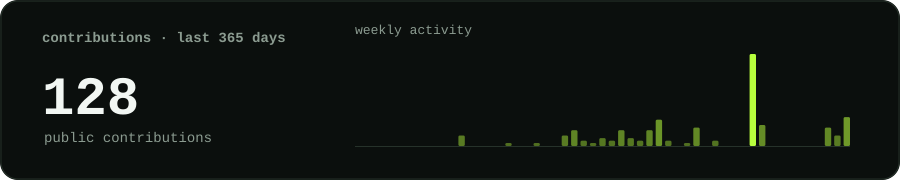
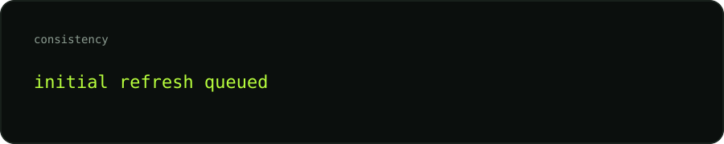
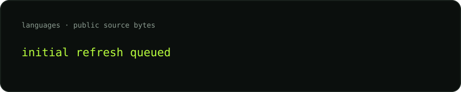
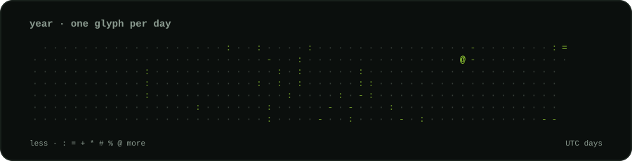

  

  <a href="mailto:ruthvikuttarala@gmail.com"><b>Email</b></a>
  ·
  <a href="https://github.com/Ruthvik-Uttarala/ruthvik-portfolio"><b>Portfolio source</b></a>
  ·
  <a href="https://github.com/Ruthvik-Uttarala?tab=repositories"><b>All repositories</b></a>

> I build production-minded software across full-stack, backend/API, AI systems, and cloud platforms. Recent work spans event-driven document processing, multimodal AI navigation, infrastructure agents, RAG systems, and operational tooling.

### current focus

<samp>BACKEND / API · FULL STACK · AI SYSTEMS · CLOUD / PLATFORM</samp>

I work primarily with **Python, TypeScript, React/Next.js, PostgreSQL, AWS, Firebase, Supabase, Kafka, Docker, and Kubernetes**. I care about clear contracts, observable systems, reliable deployment paths, and software that survives outside the demo.

### selected work

<table>
<tr>
<td width="50%" valign="top">

**[PDFextract](https://github.com/Ruthvik-Uttarala/PDFextract)**  
Event-driven PDF → Excel processing product with a Next.js frontend, Flask API, PostgreSQL, Kafka, object storage, Gemini extraction, worker orchestration, migrations, and integration tests.

<samp>Next.js · TypeScript · Flask · Python · PostgreSQL · Kafka · S3/MinIO · Gemini</samp>

</td>
<td width="50%" valign="top">

**[SilverVisit AI](https://github.com/Ruthvik-Uttarala/silvervisit-ai)**  
Safety-first Chrome extension that helps older adults navigate confusing telehealth flows using grounded screen context, typed/voice goals, Gemini Live, Cloud Run, Vertex AI, and Firestore.

<samp>TypeScript · Chrome Extension · Gemini · Vertex AI · Cloud Run · Firestore</samp>

</td>
</tr>
<tr>
<td width="50%" valign="top">

**[NovaArchitect](https://github.com/Ruthvik-Uttarala/nova-architect)**  
Autonomous infrastructure strategy agent that converts cloud snapshots into structured optimization plans, simulations, tradeoff analysis, report artifacts, and safe action workflows.

<samp>Next.js · FastAPI · Python · Amazon Bedrock · Nova 2 Lite · Nova Act</samp>

</td>
<td width="50%" valign="top">

**[Flowwick](https://github.com/Ruthvik-Uttarala/Flowwick)**  
Commerce workflow for creating one product post, enhancing copy with AI, publishing to Shopify and Instagram, and tracking the lifecycle from draft through posted.

<samp>Next.js · Supabase · Shopify Admin API · Instagram Graph API</samp>

</td>
</tr>
<tr>
<td width="50%" valign="top">

**[ParkingSol](https://github.com/Ruthvik-Uttarala/optimal-sol-webhook)**  
Parking operations intelligence layer for ingesting parking events, evaluating paid/unpaid/exempt decisions, generating violations and notifications, and powering operator workflows.

<samp>React · TypeScript · Firebase Functions · Firestore · Firebase Auth</samp>

</td>
<td width="50%" valign="top">

**[EdgeRAG Helpdesk](https://github.com/Ruthvik-Uttarala/edge-rag-helpdesk)**  
Edge-deployed retrieval system using Cloudflare Workers AI, Vectorize, and AI Gateway for document ingestion, semantic retrieval, generation, observability, and cost controls.

<samp>Cloudflare Workers AI · Vectorize · AI Gateway · RAG</samp>

</td>
</tr>
</table>

### how I build

- **Start from contracts.** Define schemas, status models, failure states, and interfaces before layering on UI polish.
- **Design for failure.** Retries, idempotency, queue fallbacks, auth boundaries, and observable execution paths are first-class concerns.
- **Keep AI grounded.** Structured outputs, retrieval, guardrails, deterministic fallbacks, and explicit evidence beat fragile prompt-only demos.
- **Own the path to production.** I like working across product surfaces: frontend, APIs, data, cloud, CI/CD, and operational verification.

### live GitHub signal

These graphics are generated inside this repository from GitHub's API by a scheduled GitHub Action. No external stats-card service is required.

### stack

<samp>
LANGUAGES&nbsp;&nbsp; Python · TypeScript · JavaScript · SQL · Go 
FRONTEND&nbsp;&nbsp;&nbsp; React · Next.js · Tailwind CSS 
BACKEND&nbsp;&nbsp;&nbsp;&nbsp; Flask · FastAPI · REST APIs · event-driven workers 
DATA&nbsp;&nbsp;&nbsp;&nbsp;&nbsp;&nbsp;&nbsp; PostgreSQL · Firestore · Supabase · Vector DBs 
CLOUD&nbsp;&nbsp;&nbsp;&nbsp;&nbsp;&nbsp; AWS · GCP · Firebase · Cloudflare · Vercel 
SYSTEMS&nbsp;&nbsp;&nbsp;&nbsp; Kafka · Docker · Kubernetes · queues · observability 
AI&nbsp;&nbsp;&nbsp;&nbsp;&nbsp;&nbsp;&nbsp;&nbsp;&nbsp; RAG · agents · Gemini · Amazon Nova · model evaluation
</samp>

### contact

If you're building a product where **software engineering, AI, and cloud systems** meet, email me at **ruthvikuttarala@gmail.com**.
